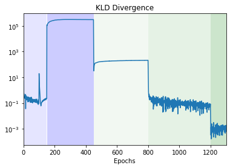

# Video Prediction 

Author: Chan Mun Fai 

This is the repository for my MSc in Artificial Intelligence individual project (dissertation) at Imperial College. 

# Table of Contents 
   * [Variational Recurrent Neural Network(VRNN)](#Variational-Recurrent-Neural-Network(VRNN))
       * [ELBO](#VRNN-ELBO)
       * [Training](#Training)
       * [Results](#Results)
   * [Stochastic Variational Video Prediction(SV2P)](#Stochastic-Variational-Video-Prediction(SV2P))
       * [ELBO](#sv2p-elbo)


# 1. Variational Recurrent Neural Network(VRNN)

The code is adapted from [here](https://github.com/emited/VariationalRecurrentNeuralNetwork) for the paper [*A Recurrent Latent Variable Model for Sequential Data*](https://arxiv.org/abs/1506.02216).

```
@inproceedings{NIPS2015_b618c321,
 author = {Chung, Junyoung and Kastner, Kyle and Dinh, Laurent and Goel, Kratarth and Courville, Aaron C and Bengio, Yoshua},
 booktitle = {Advances in Neural Information Processing Systems},
 editor = {C. Cortes and N. Lawrence and D. Lee and M. Sugiyama and R. Garnett},
 pages = {},
 publisher = {Curran Associates, Inc.},
 title = {A Recurrent Latent Variable Model for Sequential Data},
 url = {https://proceedings.neurips.cc/paper/2015/file/b618c3210e934362ac261db280128c22-Paper.pdf},
 volume = {28},
 year = {2015}
}
```

## VRNN ELBO 


## Training

I implemented the following training regime: 

1. Trained $\beta$ = 1.0 for 150 steps 
2. Trained $\beta$ = 0 for 300 steps
3. Trained $\beta$ = 0.1 for 350 steps
4. Trained $\beta$ = 0.5 for 400 steps
3. Trained $\beta$ = 0.4 for 100 steps

Training loss curves are given below: 




## Results

Reconstructed frames and predictions for the Moving MNIST dataset can be found [here](https://github.com/ChanMunFai/VideoPrediction/tree/master/results/images/v1/stochastic/stage_c). 

An example of a prediction is given below. 


The first row are ground truth frames (Frames 1 -5)  which the model has seen, the second row are ground truth frames (Frames 6 - 10) which the model does not see and is trying to predict, and the third row (Frames 6 - 10) are the predicted frames. 

# Stochastic Variational Video Prediction(SV2P) 
The code is adapted from [here](https://github.com/kkew3/cse291g-sv2p) for the paper [`Stochastic Variational Video Prediction`](https://arxiv.org/abs/1710.11252). 

```
@article{DBLP:journals/corr/abs-1710-11252,
  author    = {Mohammad Babaeizadeh and
               Chelsea Finn and
               Dumitru Erhan and
               Roy H. Campbell and
               Sergey Levine},
  title     = {Stochastic Variational Video Prediction},
  journal   = {CoRR},
  volume    = {abs/1710.11252},
  year      = {2017},
  url       = {http://arxiv.org/abs/1710.11252},
}
```

## SV2P ELBO 

Graphically, the ELBO is represented as: 


where the losses are as follows: 


The architecture of SV2P is given by

